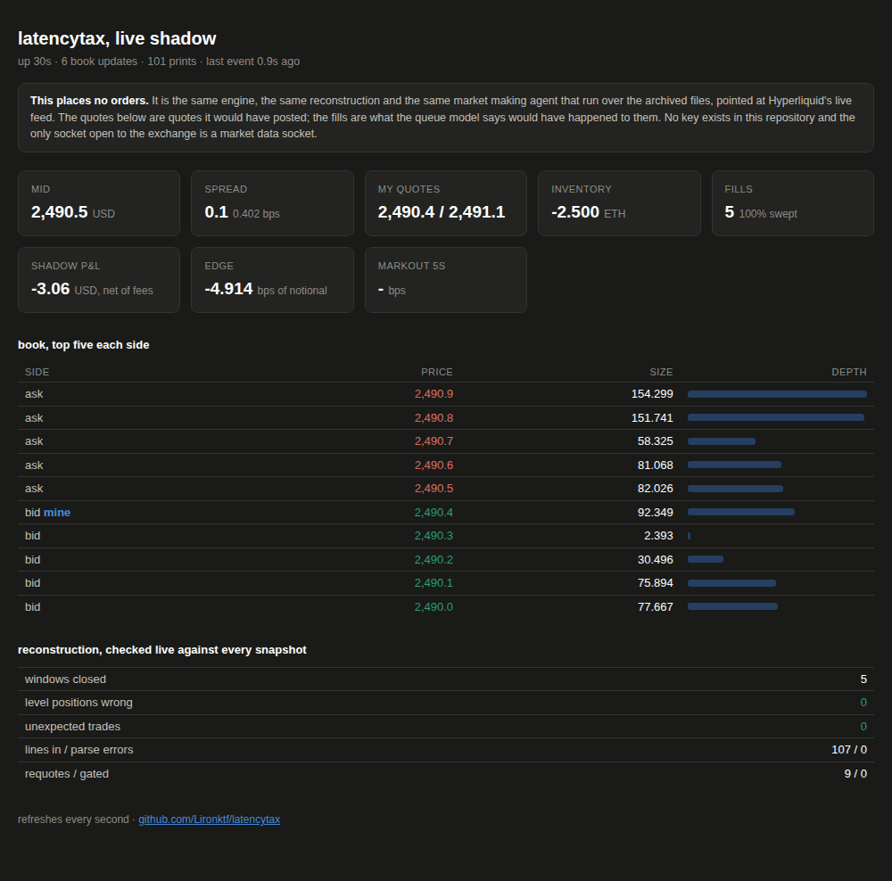
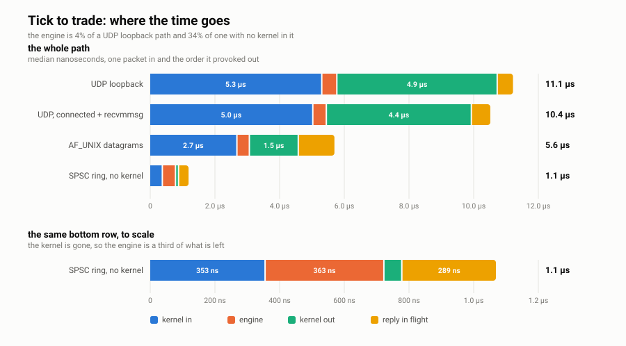

# latencytax

A limit order book and matching engine in C++20, with the market data and order
entry halves of exchange connectivity around it, checked against a real
exchange's own published book and then pointed at the live market.

About 14,000 lines, 2,800 of them tests, with no dependency outside the standard
library and zlib.

<p align="center">
  
</p>

That is the engine running on Hyperliquid's live feed, checking itself against
the exchange's book every time a snapshot arrives. It places no orders.

## The numbers

Every one has the command that produced it next to it in the linked page, and
the raw output is committed under `results/`.

| | | |
|---|---|---|
| **book correctness** | **0 wrong of 25,570,480 level positions**, 39 days, by two paths that share no code above the book | [how](docs/engine.md) |
| book operation | 48 ns median, 17.0 M msg/s at 2,000 resting orders; 176 ns and 5.1 M at 200,000 | [how](docs/engine.md#speed) |
| huge pages | +62% throughput and −37% median at 200,000 orders, same binary, one flag | [how](docs/engine.md#huge-pages-which-is-where-most-of-the-large-book-cost-was) |
| feed decode | 53.5 M msg/s, 18.7 ns per message, 1,604 MB/s | [how](docs/wire.md) |
| sharding | 6.9 → 17.6 → 23.3 M msg/s at 1, 2, 3 shards, identical books | [how](docs/wire.md#multi-symbol-and-sharding) |
| tick to trade | 11.1 µs over UDP, of which the engine is 3%; 999 ns with no kernel in the path | [how](docs/latency.md) |
| order entry recovery | connection killed with 800 acknowledgements outstanding, all 800 replayed byte for byte | [how](docs/wire.md#order-entry) |
| determinism | one input, six configurations, one event-stream hash per symbol | `scripts/run_determinism.sh` |
| queue model | AUC 0.700 on 1,035,984 holdout rows against 0.5 for the constant it replaces | [how](docs/queue-model.md) |
| latency tax | −0.001495 bps per ms over 0.1 to 100 ms, 95% CI [−0.004663, +0.000695] | [how](docs/experiment.md) |

The last one is a negative result, and it was pre-registered as the likely
outcome before the holdout was opened. On this venue the trade tape has **no
events at all between 1 ms and 30 ms**, because it batches into blocks, so an
agent at 0.1 ms and one at 33 ms are not similar, they are bit identical.
Reaction latency below the block interval is not expensive, it is unobservable.
[The full account](docs/block-interval-latency.md).

<p align="center">
  <picture>
    <source media="(prefers-color-scheme: dark)" srcset="docs/latency_budget_dark.svg">
    
  </picture>
</p>

## Build and run

Needs a C++20 compiler, CMake 3.16 or newer, and zlib.

```
cmake -B build -DCMAKE_BUILD_TYPE=Release && cmake --build build -j
ctest --test-dir build --output-on-failure
```

Ten binaries, each with `--help`:

| | |
|---|---|
| `bench` | engine latency and throughput, the ML kernels, the two decoders |
| `replay` | reconstruct the book from the raw files and score it against the exchange |
| `sim` | market making agents inside the replay, latency swept |
| `itchgen` / `itchfeed` | write an ITCH 5.0 style feed, and read it back into the engine |
| `ticktotrade` | packet in, order out, over four transports |
| `ouchgw` | SoupBinTCP sessions carrying OUCH, with a forced disconnection |
| `mlgen` / `mltrain` | build and train the queue model |
| `liveshadow` | the agent on the live feed, with a page |

And the scripts that produce everything quoted above:

```
./scripts/run_bench.sh         # the engine tables, about 7 minutes
./scripts/run_experiment.sh    # fidelity, calibration, holdout, extension, ~2 minutes
./scripts/run_queue_model.sh   # the queue model and the gated agent, ~3 minutes
./scripts/run_determinism.sh   # one input, six configurations, one hash
./scripts/run_fuzz.sh          # four libFuzzer targets under ASan and UBSan
./scripts/run_live.sh          # the live shadow, then open http://localhost:8080
```

A debug build turns on the address and undefined behaviour sanitizers, including
over the hand written AVX2 kernels. The lock free queue has its own build type
for the thread sanitizer, since ASan and TSan cannot be linked together:

```
cmake -B build-debug -DCMAKE_BUILD_TYPE=Debug && cmake --build build-debug -j
ctest --test-dir build-debug --output-on-failure

cmake -B build-tsan -DCMAKE_BUILD_TYPE=TSan && cmake --build build-tsan -j
./build-tsan/test_spsc
```

### A note for anyone who is not me

The two raw datasets are collected live into a private bucket and are not public,
so the replay, the experiment and the queue model cannot be re-run without them.
Everything else does run from a clean clone: the whole test suite, the engine and
kernel benchmarks, the ITCH and OUCH tools against synthetic flow, the tick to
trade ladder, the determinism harness and the fuzzers.

## What it is

**The engine.** Price levels in one flat array indexed directly by tick, so
reaching a level is an array index rather than a tree walk. Orders in a flat pool
with queue links as 32 bit slot indices, so an order is 32 bytes and two share a
cache line. Order ids map to slots through an open addressing table with Knuth's
backward shift deletion. Finding the next price when the touch empties uses a
bitmap with one bit per tick, scanned with count trailing zeros, and one bitmap
serves both sides because bids can only ever sit below the best ask. Nothing on
the hot path allocates and nothing anywhere touches a float.
[More](docs/engine.md).

**The reconstruction.** 5 second L2 snapshots plus a trade tape, turned into
order flow. Every print is replayed as a marketable order, then the result is
reconciled to the next snapshot. Both steps work on a shadow model built from the
raw files that never reads engine state, so the engine is *required* to agree
with the exchange rather than being quietly corrected into agreement.
[More](docs/engine.md#replay-and-fidelity), and [what the data cannot tell
you](docs/data.md).

**The wire.** ITCH 5.0 order messages, byte for byte, inside MoldUDP64 packets
with sequence numbers and gap detection, routed by the symbol index in each
header to a book per symbol across shards. Then the other half: SoupBinTCP
sessions carrying OUCH, where the interesting part is not the parsing but the
recovery contract, a client that died being able to reconnect and be made whole.
[More](docs/wire.md).

**The experiment.** An Avellaneda-Stoikov market maker inside the replay with a
queue position fill model and a configurable reaction latency, pre-registered,
run once on a holdout, then once more on 25 days nobody had looked at.
[More](docs/experiment.md).

**The model.** The fill model carries a constant where a market maker wants a per
level opinion. The half of that question with ground truth in an L2 feed, whether
the queue in front of an order trades away, is learned by a logistic regression
written from scratch on hand written AVX2 kernels. The hand written neural
network beside it loses to it, which is reported rather than buried.
[More](docs/queue-model.md).

## How it is checked

This is the part I would point an interviewer at.

- **A differential fuzz.** 320,000 random commands to both the fast book and a
  deliberately naive `std::map` reference, requiring agreement trade for trade
  including maker id, taker id and remaining size, plus a full invariant walk
  over every level, link, bitmap bit and id map entry.
- **Two independent paths to the same claim.** The replay hands the engine C++
  structs. `itchfeed` parses big endian bytes out of framed packets. Both score
  0 of 25.5 million level positions wrong across the same 39 days.
- **Four libFuzzer targets** over the ITCH path, the order entry session, the
  book driven straight from bytes, and the raw file parsers, all under ASan and
  UBSan, with the engine's own invariants asserted after every operation. No
  crashes.
- **Determinism across six configurations** on a rolling hash of every field of
  every event, in order, not just final book state. One thread, two shards, three
  shards, replayed from a journal, built at `-O0`, and with 4 KB pages instead of
  2 MB. All six agree.
- **A session state machine with no sockets in it**, so recovery can be fuzzed:
  300 sessions through a few thousand simulated disconnections at random byte
  offsets, plus the same stream fed in chunks of 1, 2, 3, 7, 13 and 64 bytes
  requiring byte identical output, because TCP does not respect message
  boundaries.
- **A pre-registered experiment** with two dated amendments, a holdout opened
  once, and a null result reported as a null result.

## What I got wrong

Every one of these is in the repository with the number it cost, because a
project where nothing went wrong is a project that was not measured.

| | |
|---|---|
| A benchmark reported **103 GFLOP/s on a core whose ceiling is 76.8**. Both inputs were loop invariant and the call was hoisted out of the timing loop. | [where](docs/queue-model.md#kernels) |
| The reseed after a feed gap stamped its deletes with the wrong timestamp, straddling a snapshot boundary. **200 wrong level positions on each of the six days with a gap**, and nothing anywhere else. | [where](docs/wire.md#what-building-it-turned-up) |
| A feature took `log1p` of a signed drift, so every sample where the mid had fallen was NaN. Trained every full model to NaN while the baselines beside them stayed fine. | [where](docs/queue-model.md) |
| The huge page mapping was size rounded but not address aligned, so it bought **14% where the machine wide setting bought 46%**. | [where](docs/engine.md#huge-pages-which-is-where-most-of-the-large-book-cost-was) |
| The recovery test replayed zero messages and passed, because a client that waits for every acknowledgement is never behind. | [where](docs/wire.md#order-entry) |
| The decoder comparison timed a whole packet path against a single message decode, and let the compiler skip most of the stores. | [where](docs/wire.md) |
| Sanitizers were quietly testing the scalar fallback, because `-march=native` was only applied to Release builds. | `CMakeLists.txt` |

## Limitations

- **Everything runs on a shared four vCPU KVM guest.** No bare metal, no isolated
  cores, no kernel bypass, no PMU. Huge pages are asked for in code and do work;
  the rest of the tuning a real deployment does is absent. Run to run throughput
  varies about 20%, which is reported rather than hidden by quoting a best run.
- **Tick to trade is loopback, not a network.** It is a floor. The SPSC ring row
  is not a bypass NIC, it is the floor one is trying to reach.
- **The book is a 5 second snapshot.** Adverse selection inside the first five
  seconds after a fill is not measurable here, which is exactly where a
  millisecond scale quote side effect would live. The tape rules out a trade side
  effect below 33 ms; it cannot rule out a quote side one.
- **Queue position inside a level is not observable in an L2 feed.** The fill
  model is a model, and its two least defensible choices are reported as
  sensitivities rather than buried. I went looking for L3 data to settle the
  cancellation half of it and
  [could not](docs/kappa-validation-attempt.md): the only per-order feed in the
  archive has one order per price level 95.7% of the time and ten accounts in the
  whole book, so there are no queues in it to measure.
- **The OUCH layouts are OUCH shaped, not certified OUCH.** The ITCH lengths match
  the published sizes. For OUCH I did not have the specification to certify every
  offset, so the message set and semantics follow 4.2 while the layouts are
  defined in the header and pinned by tests.
- **No risk layer.** No cross book risk, self trade prevention, position or credit
  limits, drop copy, or cancel on disconnect. The gateway serves one session.
- **Experiment 002 was not pre-registered.** 001 was. 002 says so at the top and
  lists every time its test set was scored and why.
- **This is a backtest, and the live shadow is a simulation standing next to a
  live market.** Neither is evidence of live profitability. Nothing here places an
  order anywhere, the live tool holds no key, and the only socket it opens to the
  exchange is a market data socket.

## Layout

```
src/engine/     order book, id map, spsc ring, multi symbol books, event hashing
src/wire/       ITCH and MoldUDP64, SoupBinTCP and OUCH, decoder, sequencer, journal
src/ml/         AVX2 kernels with scalar references, FTRL logistic, MLP, features
src/replay/     raw file parsing, reconstruction, fidelity
src/sim/        fill model, market making agent
src/util/       gzip reader, cpu pinning, cycle timing, huge page allocator
tools/          the nine tools listed above
bench/          engine, kernel and decoder benchmarks
tests/          seven test binaries, run by ctest
fuzz/           four libFuzzer harnesses and their seed corpora
scripts/        the six run scripts, plus the analysis and figure generators
experiments/    pre-registration, amendments, results
results/        the raw output of every script
docs/           the long form pages linked from this one
```

| page | what is in it |
|---|---|
| [engine.md](docs/engine.md) | the book's design, the tests, the benchmarks, huge pages |
| [wire.md](docs/wire.md) | ITCH and MoldUDP64, sharding, SoupBinTCP and OUCH, recovery |
| [latency.md](docs/latency.md) | the tick to trade ladder and the live shadow |
| [queue-model.md](docs/queue-model.md) | the learned queue model and the AVX2 kernels |
| [experiment.md](docs/experiment.md) | the latency experiment |
| [data.md](docs/data.md) | the datasets and what they cannot tell you |
| [kappa-validation-attempt.md](docs/kappa-validation-attempt.md) | trying to settle the fill model's one assumption with L3 data, and failing |
| [block-interval-latency.md](docs/block-interval-latency.md) | the long form write up of the latency result |
| [experiments/001_latency_tax](experiments/001_latency_tax) | pre-registration, two amendments, results |
| [experiments/002_queue_model](experiments/002_queue_model) | design, the audit trail, results |
| [experiments/003_wallet_toxicity](experiments/003_wallet_toxicity) | pre-registration and results for the counterparty work |

MIT licensed.
